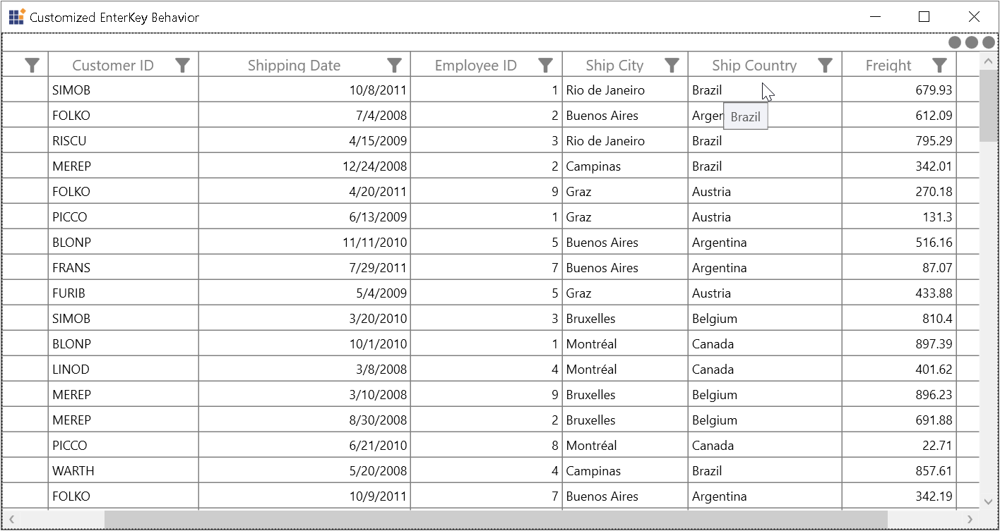

# How to Show ToolTip for the Disabled Cell in WPF DataGrid?

This sample illustrates how to show tooltip for the disabled cell in [WPF DataGrid](https://www.syncfusion.com/wpf-controls/datagrid) (SfDataGrid).

`DataGrid` allows you to show the ToolTip through ``OnMouseEnter`` event. But the tooltip will not be displayed for disabled cells in `DataGrid`. You can show the Tooltip for disabled cells by setting the values to [ToolTipTemplate](https://help.syncfusion.com/cr/wpf/Syncfusion.UI.Xaml.Grid.GridColumnBase.html#Syncfusion_UI_Xaml_Grid_GridColumnBase_ToolTipTemplate) of the column.

``` xml
<Style TargetType="syncfusion:GridCell"
        x:Key="KeyGridCellColumnCellStyle" >
    <Setter Property="IsEnabled" Value="False" />
    <Setter Property="ToolTip">
        <Setter.Value>
            <TextBlock Text="{Binding ShipCountry}" ToolTipService.IsEnabled="True" 
                                ToolTipService.ShowOnDisabled="True"/>
        </Setter.Value>
    </Setter>
    <Setter Property="ToolTipService.IsEnabled" Value="True" />
    <Setter Property="ToolTipService.ShowOnDisabled" Value="True" />
</Style>

<syncfusion:GridTextColumn HeaderText="Ship Country" MappingName="ShipCountry" 
                        CellStyle="{StaticResource KeyGridCellColumnCellStyle}"  ShowToolTip="true">
```



## Requirements to run the demo
 Visual Studio 2015 and above versions